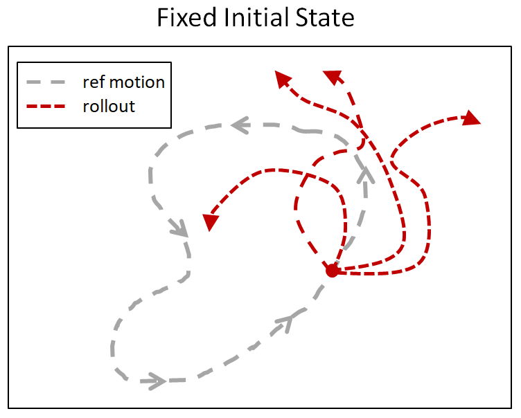
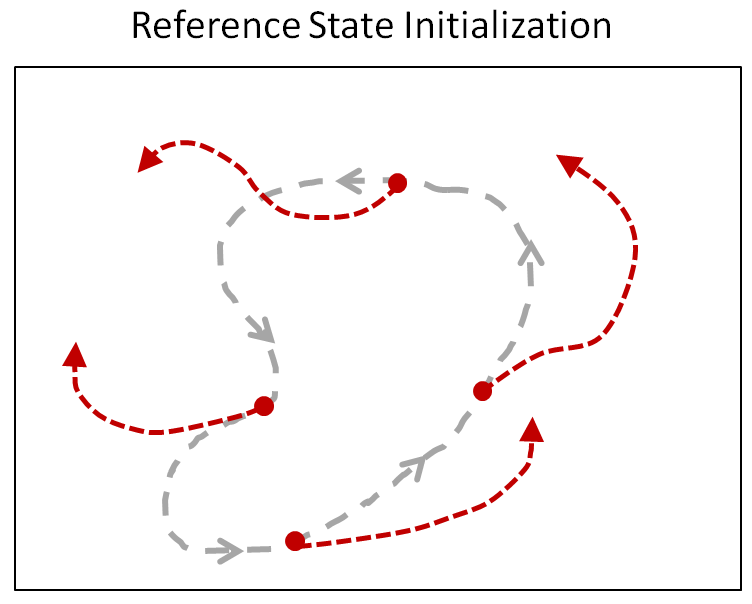

# Summary of our approach

## Key components of the final model

1. On-policy learning with Recurrent PPO
2. Reference State Initialization (RSI) to guide initial exploration and stabilize learning
3. Curriculum learning to guide and stabilize training throughout
4. (Optional) Hierarchical mixture of ensembles for dealing with specialized tasks in phase 2

### 1. Recurrent LSTM layers

The first key component in our model is the recurrent units in both the actor and critic networks of our on-policy algorithm. The first layer in each was an LSTM layer, which was crucial to deal with partial observations not only because the environment had no velocity or acceleration information, but also because the actions have really long-term consequences - effects of actions last dozens of timesteps after it has been originally executed.

### 2. Reference State Initiatlization (RSI)

The second key component we used was Reference State Initialization (RSI). The schematic below ([source](https://bair.berkeley.edu/blog/2018/04/10/virtual-stuntman/)) helps us in summarizing the idea:
 

The insight here is that if we initialize the balls at various points in the target trajectory during training, then the model will experience a much higher density of rewards throughout the final trajectory much more efficiently.

### 3. Curriculum learning

Third, we used a curriculum of training that gradually introduced the tougher aspects of the task.

For phase 1, we increased the rotation speed gradually following the intuition that once the dynamics are learnt by the recurrent units, it should be fairly easy to exploit the same dynamical modes by making rotation speed faster. As one would expect, RSI was only needed at slower speeds since the models were already doing full rotations at faster speeds and hence had already explored all of those. The exact curriculum we used is in the Appendix.

For phase 2, following the same intuition, at slower rotation periods, we gradually introduced domain randomization, i.e. noisy task physics including ball size & mass, friction, and how far the targets spawned from the balls. Once the tasks were learned well at slower speeds, we gradually increased the rotation speeds. Arguably, a large portion of training went into adapting to the noisy physics, and one of the key changes that we had to make in order to be successful at faster rotation periods with noisy task physics was to use much larger batch sizes for our networks to step meaningfully in the loss landscape. The full list of hyperparameters and links to the models are in the appendix.

### 4. Hierarchical mixture of expert ensembles

> :warning: Optional and experimental
>
> Note that we didn't have enough time to deploy this fully in the final configuration that we desired. In fact, our single model that performs the final task easily scored over 50%. The gains from this approach were marginal and ultimately not necessary for winning the Baoding balls challenge. Regardless, we list it here for completeness.

The final insight we tried to incorporate, albeit not so successfully, is to use a hierarchical model with a base network and specialist networks for subsets of the main task, along with a classifier that we trained to predict the identity of the relevant subset.

There were a couple of observations that led us to choose this approach. Crucially, we noticed that at faster rotation speeds, the networks often "forgot" some aspect of the tasks to maximize performance on the others. Here are some examples:

- one of the tasks, usually the hold task
- target positions far from the balls' initial locations
  - this was particularly disruptive in the hold task because the network learned to make the balls roughly follow the vector given by the "target error". Since the targets do not move for the hold task, the balls run into each other when the targets spawn roughly over $0.6\pi$ away from the balls.

To separately target these special cases, we trained a classifier to predict the identity of the task (hold vs other) from the first $k$ observations, and also trained a hold network to take over from the base network at timestep $k$ to perform the task. Even with this change, the hold network did not perform well at large separations of the initial ball and target positions. So we trained another set of specialist hold networks that were preferentially exposed to targets and balls spawning roughly opposite of each other, and used this ensemble of hold networks with the base network and classifier. 

For the very final submission that scored 55%, we also used an ensemble of base networks along with the classifier and the ensemble of hold networks all of which can be found [here](../trained_models/winning_ensemble).

## Appendix

### Curriculum 

#### Phase 1

1. Hold the balls fixed, initialising them at random phases along the cycle (i.e. RSI, pink).
2. Rotate the balls with period 20, initialising with RSI (orange)
3. Rotate the balls with period 10, initialising with RSI (green)
4. Rotate the balls with period 8, initialising with RSI (blue)
5. Rotate the balls with period 7, initialising at a single fixed position (similar but not exactly the same initialisation as the original task, where there is some small noise in initialisation; purple)
6. Rotate the balls with period 5, initialising at a single fixed position (idem task 5; yellow)
7. Original task for phase 1 (black)

#### Phase 2

All the trained models, environment configurations, main files, and tensorboard logs are all present in the [trained_models/curriculum_steps_complete_baoding_winner](../trained_models/curriculum_steps_complete_baoding_winner) folder. We are omitting the figure from this document because it wouldn't be possible to make sense of the single plot. Roughly, we followed  these steps in order:

- Steps 01-14 train the model to rotate the balls in both directions starting from RSI static (hold) by slowly decreasing the period to (4.5, 5.5).
  - This was trained pre-emptively before the environment for phase 2 was released since we figured that one week would probably not be enough to train for phase 2.
- Steps 15 & 16 introduce the non-overlapping targets and balls.
- Step 17 starts retraining at a slower period 25 with slightly non-overlapping balls and targets.
- Steps 18-22 train the model at period 20 by introducing a the fully-noisy task physics and non-overlapping balls & targets (deviating by up to $0.6\pi$).
- Steps 23-33 decrease the period to 8 and then to (4,6) with the full noise as in phase 2, i.e. final task. Here, we also switched to using a new set of hyperparameters which much bigger batch sizes to average over all the noise across task conditions in the gradient updates.

We have also included all of our models and classifier for the hierarchical mixture of ensembles in the [trained_models/winning_ensemble](../trained_models/winning_ensemble) folder that can be evaluated using `python src/eval_mixture_of_ensembles.py`. This was the model that scored 55% and is currently listed #1 on the leaderboard.

### Architecture, algorithm, and hyperparameters

#### Architecture and algorithm

We use [RecurrentPPO from Stable Baselines 3](https://github.com/Stable-Baselines-Team/stable-baselines3-contrib/blob/c75ad7dd58b7634e48c9e345fca8ebb06af3495e/sb3_contrib/ppo_recurrent/ppo_recurrent.py) as our base algorithm with the following architecture for both the actor and the critic with nothing shared between the two:

obs --> 256 LSTM --> 256 Linear --> 256 Linear --> output

All the layers have ReLU activation functions and the output, of course, is the value for the critic and the 39-dimensional continuous actions for the actor.

#### Hyperparameters

Initially, i.e. before step 25 in the [curriculum for Phase 2](../trained_models/curriculum_steps_complete_baoding_winner) and all of Phase 1, we used the following hyperparameters:

| Hyperparameter                             | Value                                                      |
| ------------------------------------------ | ---------------------------------------------------------- |
| Discount factor $\gamma$                   | 0.99                                                       |
| Generalized Advantage Estimation $\lambda$ | 0.9                                                        |
| Entropy regularization coefficient         | 3.62109e-6                                                 |
| PPO clipping parameter $\lambda$           | 0.3                                                        |
| Optimizer                                  | Adam                                                       |
| learning rate                              | 2.6e-5                                                     |
| Batch size                                 | 128 (sequential) transitions/env $\times$ 16 envs = 2048   |
| minibatch size                             | 32 (sequential) transitions                                |
| state-dependent exploration                | True                                                       |
| max grad norm                              | 0.835671                                                   |

For phase 2, one of the key changes that we had to make in order to be successful at faster rotation periods with noisy task physics was to use much larger batch sizes. The reason for using larger batch sizes was to allow our our networks to step meaningfully in the loss landscape by considering all possible scenarios. We used these from step 25 in the [curriculum](../trained_models/curriculum_steps_complete_baoding_winner) for phase 2 all the way to the end:

| Hyperparameter                             | Value                                                      |
| ------------------------------------------ | ---------------------------------------------------------- |
| Discount factor $\gamma$                   | 0.99                                                       |
| Generalized Advantage Estimation $\lambda$ | 0.95                                                       |
| Entropy regularization coefficient         | 3e-5                                                       |
| PPO clipping parameter $\lambda$           | 0.2                                                        |
| Optimizer                                  | Adam                                                       |
| learning rate                              | 2.5e-5                                                     |
| Batch size                                 | 1024 (sequential) transitions/env $\times$ 16 envs = 65536 |
| minibatch size                             | 1024 (sequential) transitions                              |
| state-dependent exploration                | True                                                       |
| max grad norm                              | 0.8                                                        |
